# 01. 카드 마스터 · 시세 — ERD

> 근거: [`docs/정의서/01_카드마스터_시세_정의서_260802_v0.md`](../정의서/01_카드마스터_시세_정의서_260802_v0.md)
> **버전** `260805_v1` · **최종 수정** 2026-08-05 · **수정자** pykangmin · 렌더링: Mermaid
> 기준: [초기 전략 2026-07-28](../../memory.md) — 초기 출시 = 게시글 · 커뮤니티 · 카드 시세
>
> **컬럼 전체·타입·데이터 예시는 정의서 본문**에 있습니다. 여기서는 **키와 관계**만 봅니다.
> 이 md 가 PDF 본문입니다. `node build_pdf.js` 로 같은 이름의 PDF 를 굽습니다.

---

## 0. 계층

```
SOURCE / MASTER / REFERENCE / CONFIG
        ↓
SEMANTIC FACT      체결 사실 · 일별 가격 관측 · 등급 분포
        ↓
READ MODEL         조회 사용사례 하나에 하나
        ↓
화면
```

| 객체 | 형태 |
|---|---|
| `trade_sale_event` | table (append-only) |
| `price_observation_daily` | view |
| `population_grade_current` | table |
| `card_market_summary` | table (증분 UPSERT) |
| `v_card_price_timeline` · `v_card_recent_trades` · `v_card_population_summary` | view |
| `card_search_index` | table + GIN |

정규화는 fact 계층에서 한 번만. 앱은 read model 밖을 읽지 않습니다.

---

## 1. 화면 계약도

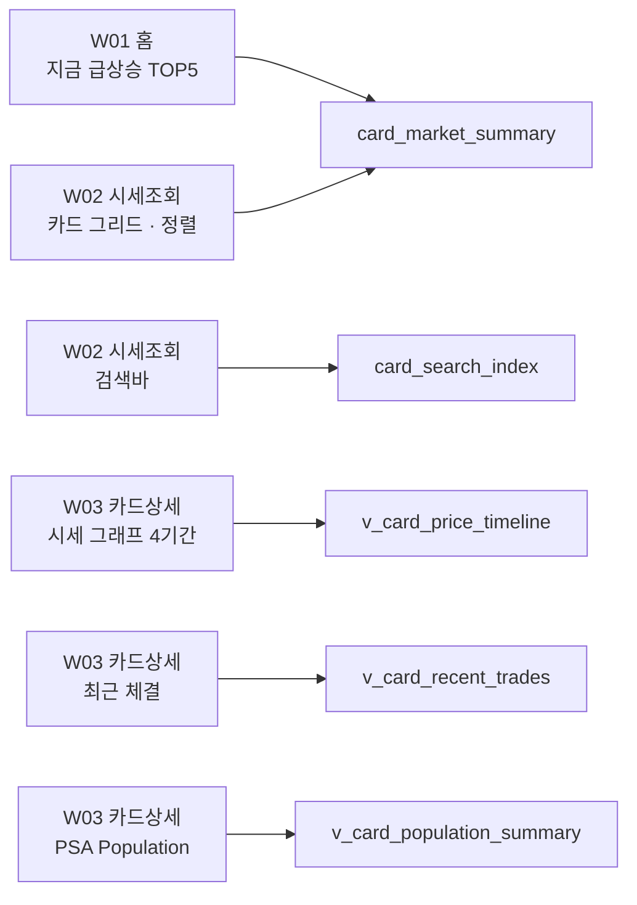

---

## 2. `trade_sale_event` 계보 — 체결 사실

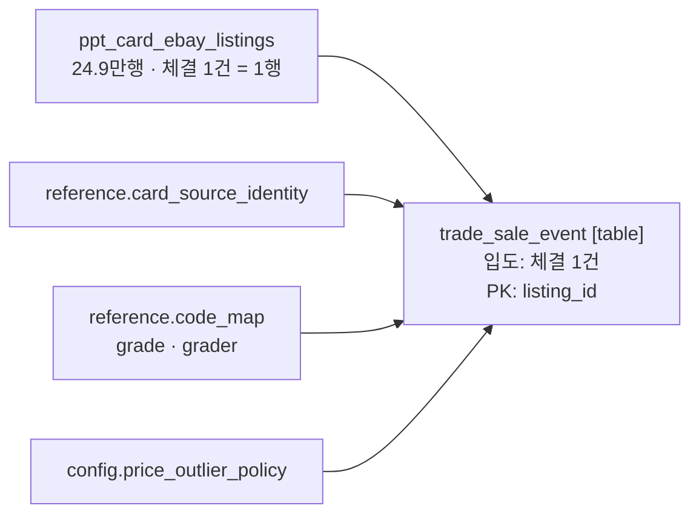

---

## 3. `price_observation_daily` 계보 — 일별 가격 관측

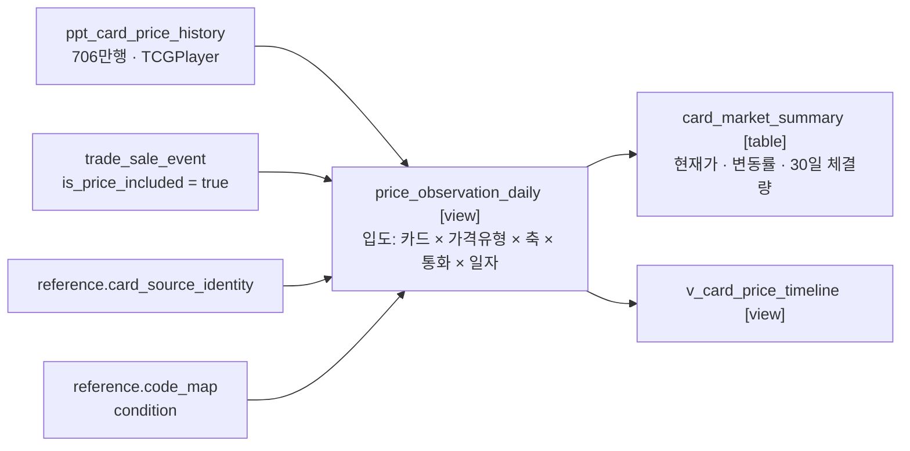

| `price_type` | 원천 | 축 | `sample_count` |
|---|---|---|---|
| `MARKET_SNAPSHOT` | TCGPlayer 시장 기준가 | `condition_code` | NULL |
| `SALE` | eBay 체결 일별 집계 | `grade_code` | `COUNT(*)` |

---

## 4. `population_grade_current` 계보 — 등급 분포

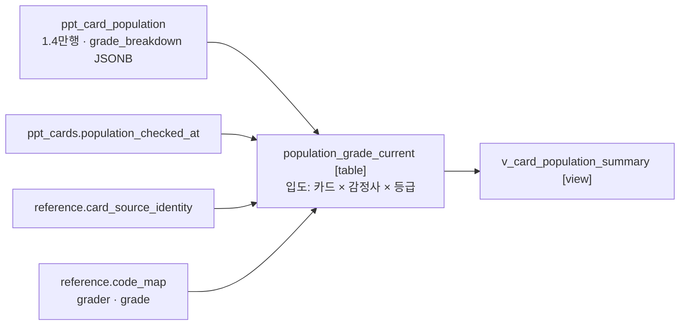

원천이 현재 상태만 보존하므로 `_current`. `total_population`·`gem_rate`는 유도값이라 내보내지 않고 `grade_breakdown` 합계가 정본입니다.

---

## 5. `card_search_index` 계보

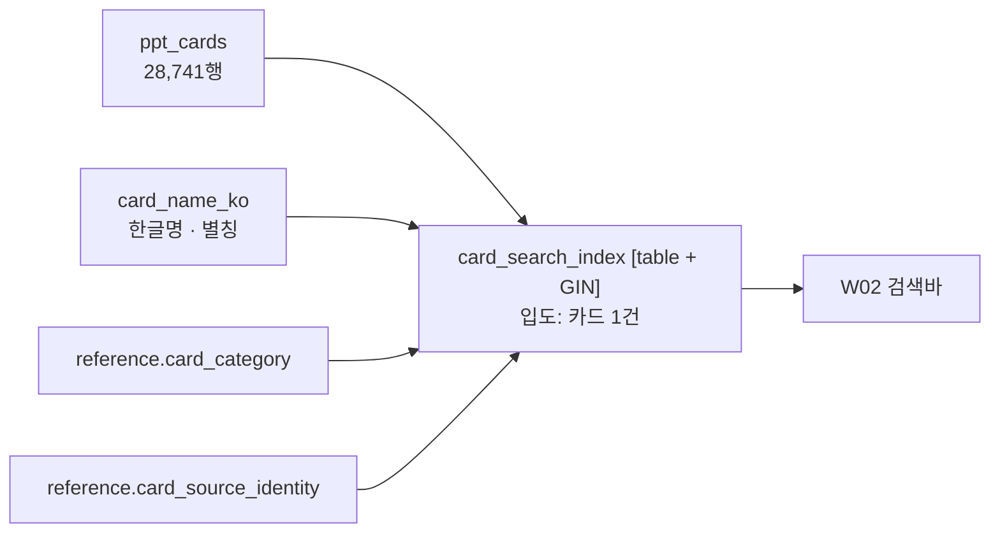

컬럼: `canonical_card_id` · `display_name` · `normalized_search_text` · `alias_search_text` · `category_code` · `search_priority`

---

## 6. 물리 ERD — reference

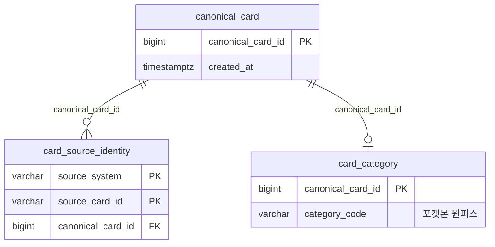

---

## 7. 물리 ERD — code · config

카드와 조인 키가 없는 독립 마스터입니다.

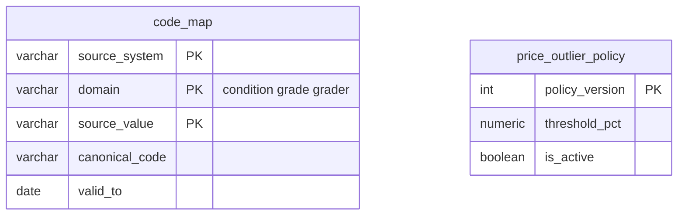

---

## 8. 물리 ERD — gold · fact

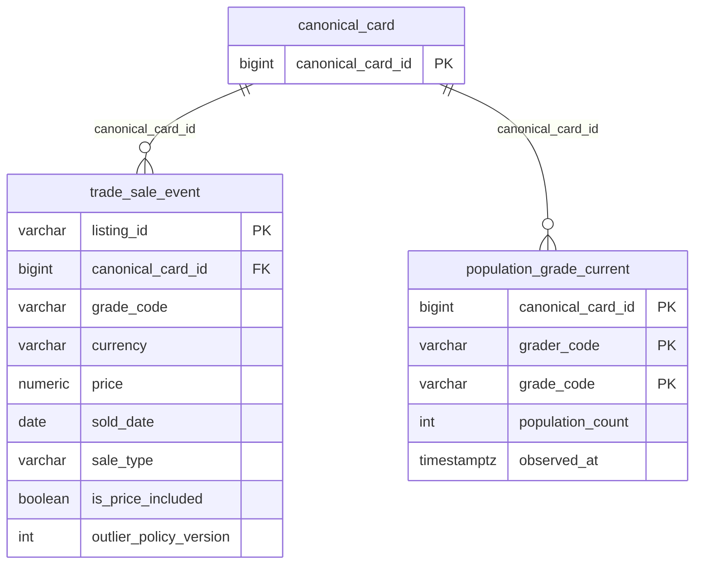

---

## 9. 물리 ERD — gold · read model

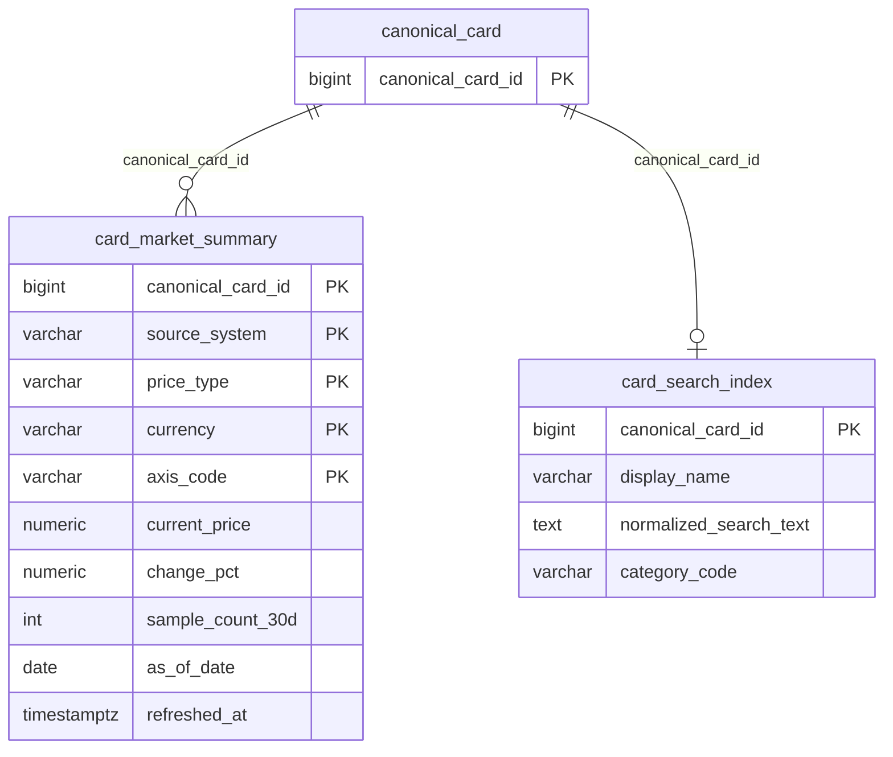

---

## 10. 물리 ERD — silver · 카드 마스터

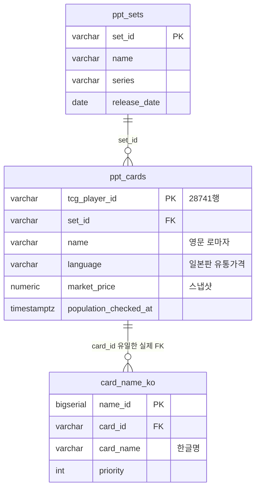

---

## 11. 물리 ERD — silver · 시세

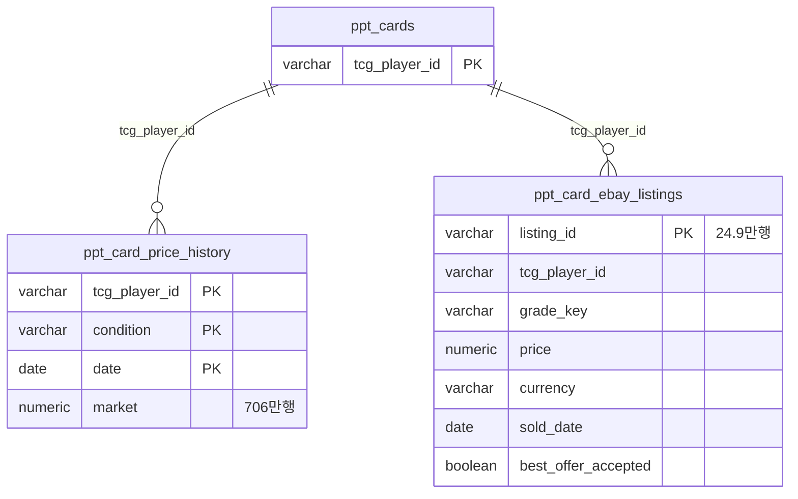

---

## 12. 물리 ERD — silver · 등급판정

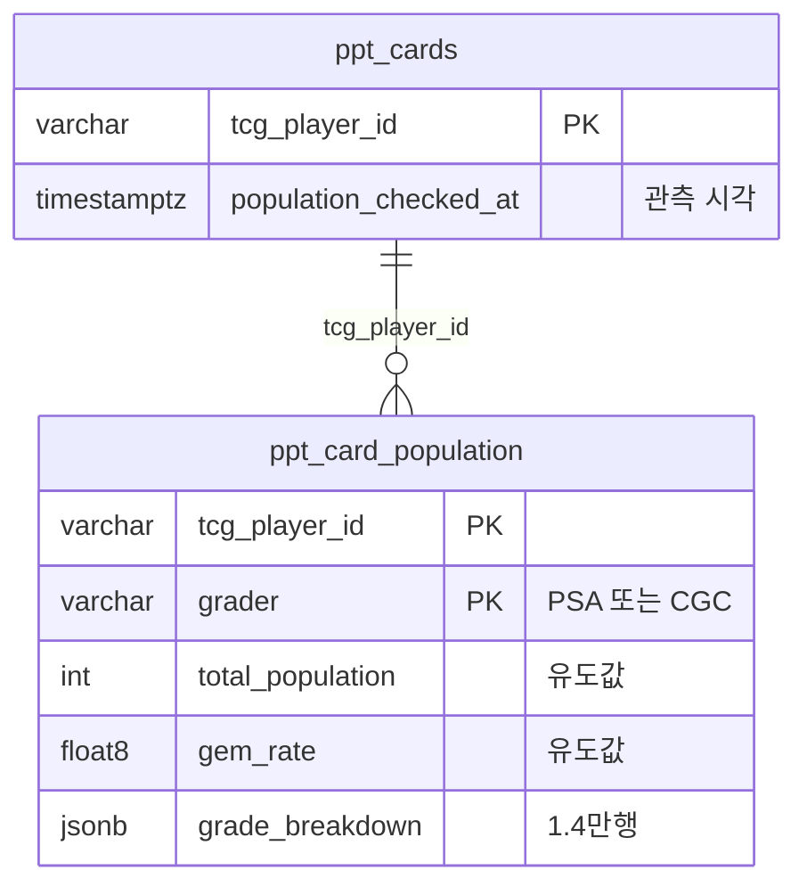

`ppt_*`에는 실제 FK 제약이 없습니다. 진짜 `REFERENCES`는 `card_name_ko.card_id` 하나뿐입니다.
`fx_exchange_rates`·`market_indices`는 카드와 조인 키가 없어 제외했습니다.
`ppt_card_ebay_price_history`(18.6만행)는 원본과 동기화 불일치로 미사용입니다.

---

## 13. 검토 필요

> 근거 표기 = `정의서 파일명 §절 대상테이블 L행`. 파일은 모두 [`docs/정의서/`](../정의서/) 아래에 있습니다.

| # | 근거 | 문제 | 수정 제안 |
|---|---|---|---|
| 1 | [01_카드마스터_시세_정의서 §4 fx_exchange_rates L368](../정의서/01_카드마스터_시세_정의서_260802_v0.md#L368) · 경고는 [L393](../정의서/01_카드마스터_시세_정의서_260802_v0.md#L393) | `fx_exchange_rates`에 `quote_unit`이 없다. 한국수출입은행은 엔화를 100엔당 고시하므로 **엔화가 100배**로 표시된다. 적재분이 일본판 위주라 실제로 발생 | DDL 에 `quote_unit INT NOT NULL DEFAULT 1` 추가. JPY 행은 100 |
| 2 | [01_카드마스터_시세_정의서 §4 card_name_ko L344](../정의서/01_카드마스터_시세_정의서_260802_v0.md#L344) | `card_name_ko.priority`에 유일성 제약이 없고 `DEFAULT 1`이라 한 카드에 대표명이 여러 개 생긴다. [04번](04_마이보유자산_ERD.md)이 `priority=1`로 조인해 **자산 목록 중복·합계 2배** | `CREATE UNIQUE INDEX ... ON card_name_ko (card_id) WHERE priority = 1` |
| 3 | [01_카드마스터_시세_정의서 §4 price_outlier_rules L425](../정의서/01_카드마스터_시세_정의서_260802_v0.md#L425) · [L442](../정의서/01_카드마스터_시세_정의서_260802_v0.md#L442) | `threshold_pct`가 "중앙값 대비 편차"인데 **무엇의 중앙값인지 정의가 없다**(전체 기간 / 최근 30일 / 당일). 셋이 다른 결과를 낸다. 문서는 "걸러집니다"라고 단정 | 중앙값 산정 창을 명시하고 `price_outlier_policy`에 컬럼으로 둔다. 정해지기 전엔 `is_price_included` 구현 불가 |
| 4 | [01_카드마스터_시세_정의서 §5 v_card_price_change L525](../정의서/01_카드마스터_시세_정의서_260802_v0.md#L525) vs [L59](../정의서/01_카드마스터_시세_정의서_260802_v0.md#L59) | `change_pct`가 실제로는 "직전 관측 대비"인데 §1은 "전일 대비"로 정의. 체결이 드문 카드는 3개월 변동률이 **급상승 상위를 독식** | 비교 기간을 고정(전일 / 최근 7일)하고 최소 관측 건수 조건 추가 |
| 5 | [01_카드마스터_시세_정의서 §3 ppt_card_ebay_listings L266](../정의서/01_카드마스터_시세_정의서_260802_v0.md#L266) | `best_offer_accepted`(협상 성사가)·`listing_type`(경매)이 미사용이라 **정가와 섞여 평균**에 들어간다 | `trade_sale_event.sale_type`으로 도출하고 포함 여부를 `is_price_included` 규칙에 반영 |
| 6 | [01_카드마스터_시세_정의서 §3 ppt_raw_cards L121](../정의서/01_카드마스터_시세_정의서_260802_v0.md#L121) vs [L155](../정의서/01_카드마스터_시세_정의서_260802_v0.md#L155) | `ppt_raw_cards.tcg_player_id`만 `TEXT`이고 나머지는 `VARCHAR(50)`. 정제 시 조인하는 키인데 타입이 다르다 | `VARCHAR(50)`으로 통일 |
| 7 | [01_카드마스터_시세_정의서 §6 L624](../정의서/01_카드마스터_시세_정의서_260802_v0.md#L624) | 검색 SQL 이 한 줄도 없다. 공백 무시 매칭·별칭 우선순위·인덱스 미설계. `is_searchable`도 미사용 | `card_search_index` 물리 테이블 + `pg_trgm` GIN. 정규화 텍스트를 미리 적재 |
| 8 | [01_카드마스터_시세_정의서 §5 v_population_grade_count L614](../정의서/01_카드마스터_시세_정의서_260802_v0.md#L614) | 부록이 "v0 원문은 git 이력에서 확인"이라 하지만 **이 파일은 커밋된 적이 없다**(`docs/카드시세/` 전체 untracked였음). 폐기 SQL 복구 경로 없음 | 로컬 사본 확인. 없으면 부록의 안내 문구를 삭제 |
| 9 | [01_카드마스터_시세_정의서 §1 L26](../정의서/01_카드마스터_시세_정의서_260802_v0.md#L26) · [L54](../정의서/01_카드마스터_시세_정의서_260802_v0.md#L54) · [L446](../정의서/01_카드마스터_시세_정의서_260802_v0.md#L446) · [L617](../정의서/01_카드마스터_시세_정의서_260802_v0.md#L617) | 뷰 개수가 §1 제목 4 / §1 표 5 / §5 4 로 다르고 이름도 두 벌. §6 검증표는 **존재하지 않는 뷰 이름**으로 "담당 있음"을 통과시킨다 | §5(v1)를 정본으로 §1·§6 갱신 |
| 10 | [01_카드마스터_시세_정의서 §5 v_population_grade_count L594](../정의서/01_카드마스터_시세_정의서_260802_v0.md#L594) vs [L646](../정의서/01_카드마스터_시세_정의서_260802_v0.md#L646) | §5에서 제외한 `V_card_price_depth`가 §1·§6·§7에 잔존. §7은 **제외한 뷰의 기준가를 "결정 완료"로 기록** | 2단계 항목으로 옮기고 §7 결정 표에서 제거 |
| 11 | [01_카드마스터_시세_정의서 §7 L652](../정의서/01_카드마스터_시세_정의서_260802_v0.md#L652) vs [L549](../정의서/01_카드마스터_시세_정의서_260802_v0.md#L549)·[L571](../정의서/01_카드마스터_시세_정의서_260802_v0.md#L571) | §7이 "확인 필요 — 없습니다"라 선언하는데 본문이 설계 미결정 19·20을 참조. 19번(인기순 정렬 기준)은 화면에 직접 영향 | 미결 2건을 §7로 올린다 |
| 12 | [01_카드마스터_시세_정의서 §5 price_outlier_rules L454](../정의서/01_카드마스터_시세_정의서_260802_v0.md#L454) vs [L366](../정의서/01_카드마스터_시세_정의서_260802_v0.md#L366)·[L634](../정의서/01_카드마스터_시세_정의서_260802_v0.md#L634) | §5는 "원화 저장·계산 금지"인데 §4·§6은 `fx_exchange_rates`가 화면 원화를 담당한다고 적었다. **환산 주체가 문서 안에서 미정** | ADR 로 분리 — 아래 §14 |
| 13 | [01_카드마스터_시세_정의서 §5 v_card_key L462](../정의서/01_카드마스터_시세_정의서_260802_v0.md#L462) | §5 뷰가 `reference.card_source_identity`·`code_map`에 의존하는데 **정의서 7종 어디에도 정의가 없다.** 정의서만 받으면 뷰를 하나도 못 만든다 | `reference.*` 4종을 정의서에 편입하거나 소유 문서를 명시 |
| 14 | [01_카드마스터_시세_정의서 §6 L624](../정의서/01_카드마스터_시세_정의서_260802_v0.md#L624) | `ppt_sets`에 게임 구분 컬럼이 없고 적재 28,741행이 전부 포켓몬. 카테고리 탭 근거가 없다 | `reference.card_category` 도입. 런칭은 포켓몬·원피스 2종 |
| 15 | [01_카드마스터_시세_정의서 §3 ppt_card_ebay_sales L301](../정의서/01_카드마스터_시세_정의서_260802_v0.md#L301) | `ppt_card_ebay_sales`(스마트 추정시세 4.5만행)가 **어느 계층에도 배정돼 있지 않다** | fact 로 넣을지, read model 로 낼지, 초기 출시에서 뺄지 결정 |
| 16 | [01_카드마스터_시세_정의서 §4 market_indices L395](../정의서/01_카드마스터_시세_정의서_260802_v0.md#L395) vs [`card_service_erd.dbml`](../카드시세/erd/card_service_erd.dbml) | `market_indices`(KOSPI)를 정의서는 포함, 서비스 ERD 는 "1차에 화면 없음"으로 명시적 제외. 두 문서가 반대 | 어느 쪽이 정본인지 확정 |
| 17 | [01_카드마스터_시세_정의서 §3 ppt_card_ebay_price_history L297](../정의서/01_카드마스터_시세_정의서_260802_v0.md#L297) · [L536](../정의서/01_카드마스터_시세_정의서_260802_v0.md#L536) | 원천 최신이 2026-07-28인데 30일 창은 `CURRENT_DATE` 기준. 수집이 멈추면 `sample_count`가 **에러 없이 0으로 수렴** | `refreshed_at`·`source_max_observed_date`를 공개하고 신선도 임계·알람 설정 |
| 18 | — | `card_market_summary` 갱신 방식 미정 | 증분 UPSERT 권장. MV 로 시작한다면 전체 refresh 실행시간 측정 · `CONCURRENTLY`용 unique index · 허용 신선도 SLA 를 함께 명시 |

---

## 14. 통화 환산 — ADR 필요

v1 계약(D25)이 "원화는 저장도 계산도 하지 않는다"이므로 셋을 함께 정해야 합니다.

| 결정 | 선택지 | 파급 |
|---|---|---|
| 누가 | API 계층 / DB 조회 계층 | API 면 앱이 `fx_exchange_rates`(silver)를 직접 읽어 read model 경계를 우회 |
| 어느 시점 환율 | 거래일 / 조회일 최신 | 조회일 최신이면 카드값이 그대로여도 **과거 원화 자산가치가 소급 이동** |
| 배치 경로 | — | [05번 `price_alert_rules`](05_알림_ERD.md)의 KRW 하한·상한을 평가하는 배치는 API 를 안 거친다. 소유자를 API 로 정하면 **시세 알림이 막힌다** |

통화가 키에 남는 동안 **W02 가격순 정렬은 환산 없이 불가능**합니다. `change_pct`는 무단위라 무관하지만 가격은 USD·EUR 를 한 줄로 세울 수 없습니다.

ADR 이전에 [04](04_마이보유자산_ERD.md)·[05](05_알림_ERD.md)를 완성하면 다시 고치게 됩니다.

---

## 15. 관련 문서

*   정의서 — [`01_카드마스터_시세_정의서_260802_v0.md`](../정의서/01_카드마스터_시세_정의서_260802_v0.md)
*   서비스 ERD — [`card_service_erd.dbml`](../카드시세/erd/card_service_erd.dbml)
*   원천 ERD — [`card_price_erd.dbml`](../카드시세/erd/card_price_erd.dbml)
*   소비처 — [`04_마이보유자산_ERD.md`](04_마이보유자산_ERD.md) · [`05_알림_ERD.md`](05_알림_ERD.md)
*   정합성 검토 — [`정합성검토_260804.md`](../report/테이블정의서_0802_CADO기준_정합성검토_260804.md) (⚠️ 피벗 미반영 기준 — 오리파·배송 지적은 무효)

---

## 16. 변경 이력

| 버전 | 날짜 | 수정자 | 내용 |
|---|---|---|---|
| `260805_v1` | 2026-08-05 | pykangmin | 최초 작성 — 정의서 기준 ERD, 검토 필요 표 |
